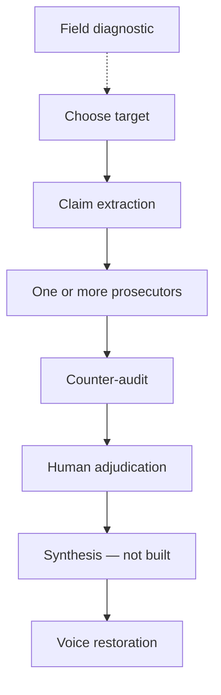

# Provenance

**A guided audit sequence for research and media claims\.** Provenance separates
what was measured from what was claimed, checks source and citation paths against
retrieved material, tests its own preferred explanation, and preserves the
evidence state of every consequential finding\.

> It points; you judge.

Provenance is not an AI truth machine or an automated fact score\. It is a set of
structured prompts, checks, fixtures, and run records designed to turn an anomaly
into an inspectable adjudication packet\.

## What the toolkit does

- stabilizes the exact claim or event before critique begins;
- distinguishes supplied, retrieved, recalled, and missing material;
- separates construct, internal\-validity, citation\-network, and media\-construction
  questions rather than collapsing them into one verdict;
- traces where a claim changed and which layer owns the change;
- tests operator hypotheses through confirming and disconfirming retrieval;
- counts independent information origins rather than publication logos;
- preserves findings that are narrowed, reframed, reclassified, or killed later;
- ends in human adjudication rather than a composite score; and
- keeps the prompt’s own failures, fixes, and regression cases in the repository\.

## Two branches

### Research



The Stage 2 prosecutors are independent and can run in any order:

- [construct validity](prompts/research-analysis/2-construct-validity.txt);
- [internal validity and replication](prompts/research-analysis/2-internal-validity.txt);
- [citation network](prompts/research-analysis/2-citation-network.txt)\.

They consume the same [claim map](prompts/1-claim-extraction.txt)\. Run one, two,
or all three\. The [counter\-audit](prompts/research-analysis/3-counter-audit.txt)
then audits the prosecution: whether it attacked the intended claim, ignored the
source’s own defenses, relied on weak opposition, or split one mechanism into
several findings\.

### Media

The media branch has two independently runnable instruments:

- [framing and construction](prompts/media-analysis/2-framing-construction.txt)
  for one piece;
- [coverage network](prompts/media-analysis/2-coverage-network.txt) for multiple
  pieces covering the same event or claim\.

There is no separate media counter\-audit\. Timing checks, source inheritance,
sample limits, innocent explanations, and flip/mirror tests are internal to the
two prompts\. That is a design decision, not a missing Stage 3 file\.

## How Provenance stays honest

|Risk                                                      |Safeguard                                                                                               |
|----------------------------------------------------------|--------------------------------------------------------------------------------------------------------|
|The operator begins with a preferred answer               |Hypothesis-origin labels, balanced retrieval, flip/mirror checks, and the concede test                  |
|A model fills gaps from fluent memory                     |Retrieval states, locators, access boundaries, and provisional caps                                     |
|Repetition looks like corroboration                       |Per-fact source-chain analysis and independent-origin counts                                            |
|The audit attacks the easiest version of a claim          |A shared claim map, single-claim scope, attribution checks, and failure-location labels                 |
|A cited field premise passes as settled fact              |Retrieval of construct establishment, actual items/coding rules, contrary evidence, and citation context|
|A prompt produces a complete-looking but incomplete output|Execution contracts, completion gates, mechanical checks, and preserved raw output                      |
|A repair silently breaks an older capability              |Precommitted regression cases and cross-version interaction checks                                      |
|Several weak signals become one authoritative score       |Disaggregated findings and mandatory human adjudication                                                 |

## Current state

This is an active research toolkit, not a finished application\.

|Area                     |Current state                                                                                                                                                             |
|-------------------------|--------------------------------------------------------------------------------------------------------------------------------------------------------------------------|
|Run record               |42 logged runs: 23 research and 19 media                                                                                                                                  |
|Research branch          |Claim extraction, construct validity, citation network, and counter-audit have run evidence; internal validity has never been run                                         |
|Citation execution       |Completion contract passed three supplied-packet pilots through 26 sources and 70 selected edges; open retrieval remains unvalidated                                      |
|Media source independence|Proposition-level origin repair is canonical and exercised                                                                                                                |
|Ceuta regressions        |`FAIL-MB-017/018` cases are complete and passed on the integrated RC2 artifact; their execution blocks are not yet synchronized into the shorter canonical coverage prompt|
|Acquittal                |Individual stages have returned clean results; no full research chain has acquitted, and the media clean case is built but unrun                                          |
|Stage 4 synthesis        |Planned, not built                                                                                                                                                        |
|Webapp                   |Incomplete sandbox prototype; useful for browsing/copying, not a supported execution surface                                                                              |

For the artifact\-by\-artifact reconciliation, see the
[current\-state inventory](reference/current-state-inventory.md)\. For observed
behavior rather than architecture, see [tests/RESULTS\.md](tests/RESULTS.md)\.

## Start an audit

1. Start with the [field diagnostic](prompts/0-field-diagnostic.txt) if the field
   and your own position need calibration, or start directly from a known target\.
2. Gather the fullest available source, relevant versions, and any primary or
   downstream material\. State what is missing\.
3. For research, run [claim extraction](prompts/1-claim-extraction.txt), then one
   or more independent prosecutors\. For media, choose the single\-piece or network
   instrument\.
4. Preserve the exact prompt version, model/version, retrieval boundary, raw
   output, and evidence locators\.
5. Apply the counter\-audit where the branch has one, then adjudicate the surviving
   findings as a human\.
6. Record what fired, what changed, and what was killed\. A pass belongs in the
   record too\.

Live audits require supplied sources or retrieval capability wherever a finding
depends on external verification\. A closed fixture stays closed; do not browse to
complete it from outside knowledge\.

For citation\-network outputs, the repository includes a mechanical completion
checker:

```bash
python3 prompts/research-analysis/check-citation-network-output.py audit-output.txt
```

It checks required structure and gate behavior, not substantive correctness\.

## Choosing a model for a manual run

Written vendor\-neutral so it stays useful as model names change; the concrete
mapping below is one example, current as of 2026\-08\.

### Match reasoning effort to the stage, not to the document

Reasoning effort should scale with ADJUDICATION LOAD, not with source length\. The
stages differ sharply on this, and over\-provisioning is expensive in wall\-clock
time without improving the output\.

|Stage|Effort tier|Why|
|---|---|---|
|Claim map (1-claim-extraction)|mid-to-high|Extraction and disciplined scope selection. Bounded, largely mechanical: read the source, fill the fields, apply the Rule 1/Rule 2 selection. Extra effort does not buy more discipline here — the rules do that.|
|Prosecutors (construct / internal / citation-network)|high|Sustained retrieval plus adversarial argument against a fixed object. Retrieval depth is the binding constraint, not raw reasoning.|
|Whole sequence in one model|high|Default when running end to end.|
|Counter-audit, contested adjudication, final synthesis|max|Reserve the top tier for stages that genuinely weigh competing findings against each other. This is the only place prolonged reasoning changes the answer.|

Example mapping \(ChatGPT tiers, 2026\-08\): claim map → Terra High; prosecutors →
Sol High; whole sequence → Sol High; counter\-audit / synthesis → Sol Max\.

COST NOTE, observed: a construct\-validity run executed at max effort took \~25
minutes\. The same stage at high effort is materially faster and, in the runs
logged here, not visibly worse\. Max effort on a prosecutor stage is a poor trade
— prosecutor quality is dominated by what was retrieved, not by how long the
model deliberated\.

Running several audits in parallel is a good reason to drop a tier, not a reason
to raise one\.

### Why the sequence is worth splitting across models

Multi\-model runs have repeatedly surfaced failures a single model could not:
the same input has produced divergent independence counts \(FAIL\-MB\-008\),
flipped amplification verdicts \(FAIL\-MB\-009\), and flipped construct verdicts
\(FAIL\-CV\-005\)\. Where two models on the same object disagree, the disagreement
is itself the finding — it usually locates an unspecified convention in the
prompt rather than a difference of evidence\.

### Retrieval matters more than model choice

Every construct\-side check is gated on what was actually fetched\. An abstract\-
only run will not produce a weaker version of a full\-text audit; it produces a
differently\-wrong one \(FAIL\-CV\-003\)\. If the instruments, the introduction, and
the cited establishment literature cannot be retrieved, say so and let the
findings cap at PROVISIONAL rather than substituting background knowledge\.


## Repository map

|Path                                                                          |Role                                                               |
|------------------------------------------------------------------------------|-------------------------------------------------------------------|
|[`prompts/`](prompts/)                                                        |Canonical execution instructions                                   |
|[`reference/philosophy.md`](reference/philosophy.md)                          |Governing epistemic commitments                                    |
|[`reference/methodology.md`](reference/methodology.md)                        |Sequence, handoffs, evidence axes, and run discipline              |
|[`reference/architecture-note.md`](reference/architecture-note.md)            |Cross-prompt constraints and open decisions                        |
|[`reference/current-state-inventory.md`](reference/current-state-inventory.md)|Canonical, tested, duplicated, unfinished, and superseded state    |
|[`FAILURES.md`](FAILURES.md)                                                  |Failure registry and deletion protection                           |
|[`CHANGELOG.md`](CHANGELOG.md)                                                |Why rules changed                                                  |
|[`tests/`](tests/)                                                            |Regression discipline, fixed cases, raw runs, and observed behavior|
|[`compliance/`](compliance/)                                                  |Citation-network supplied-packet pilots and evaluations            |
|[`TODO.md`](TODO.md)                                                          |Pending implementation work                                        |
|[`Revision_Log_v0.2.xlsx`](Revision_Log_v0.2.xlsx)                            |Supplemental revision ledger; not a prompt source of truth         |
|[`webapp/provenance.html`](webapp/provenance.html)                            |Experimental sandbox prototype and derivative prompt snapshots     |

## Prototype boundary

The webapp can navigate the sequence, display selected run material, copy
embedded prompts, and keep a local browser notebook\. It does not run models,
retrieve sources, execute the checker, update repository logs, or write canonical
files\.

Its embedded prompt copies are generated from repository files and carry path,
checksum, size, line\-count, and snapshot metadata\. Maintainers can verify parity
with:

```bash
python3 tools/embed_prompts.py --check
```

The repository prompt wins on every conflict\.

## Relationship to *The Same Four Failures*

Provenance grew out of
[*The Same Four Failures, Different Fields*](https://github.com/yungmulaBABY1/the-same-four-failures-or-field-map-adversarial-research)\.
That project organized recurring failure shapes\. Provenance moves the center of
gravity upstream: first identify the claim, evidence state, source path, and
failure layer; only then ask whether a familiar failure shape is actually
present\.

The taxonomy supplies possibilities, not a predetermined verdict\.

## Limits

Provenance does not guarantee complete retrieval, discover every field\-specific
mechanism, establish intent from textual construction, infer truth from majority
coverage, or convert a weak citation network into disproof of the underlying
real\-world proposition\.

One paper does not establish a field pattern\. One article does not establish an
outlet practice\. A clean audit means the checks performed found nothing
consequential; it is not a guarantee that nothing was missed\.

The project does not yet include a license file\. Do not infer permissions from
the repository being public\.

## Change discipline

Treat a prompt change as an instrument change\. Before deleting or consolidating
a rule, identify:

1. the failure it prevents;
2. whether that failure was observed or anticipated;
3. where the protection moves; and
4. which regression case will detect recurrence\.

Start wherever the anomaly appears\. Keep the claim stable\. Finish with receipts\.
