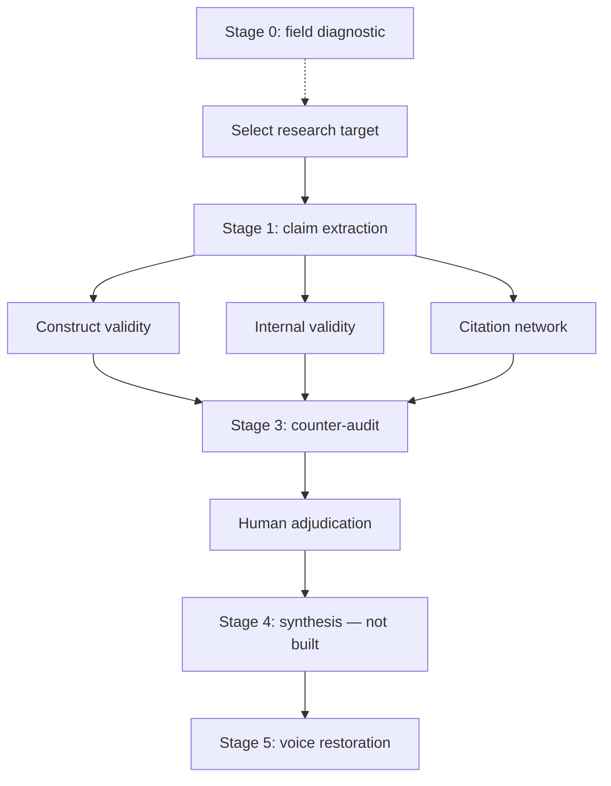
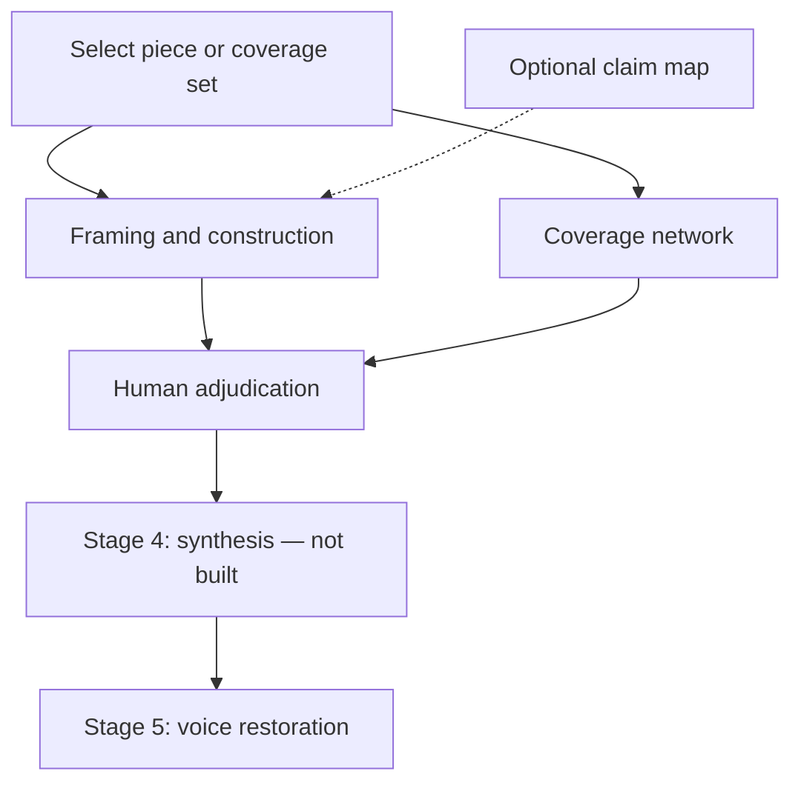

Provenance Methodology

How an anomaly becomes an adjudication packet.

> **Status:** First repo-grounded draft, 2026-08-09. This document describes the
> implemented prompt sequence and marks known gaps. It does not resolve the
> documentation and prompt inconsistencies tracked in `TODO.md`.

Scope and source of truth

Provenance is a guided audit sequence for research and media claims. Its stages
are structured prompts run in a model, with the target material and prior
outputs supplied by the operator. Live audits require retrieval capabilities or
supplied sources wherever a finding depends on external verification. The web
interface presents the sequence and finished runs; it does not execute the
audits.

The files under prompts/ are the operational source of truth. This document
explains their relationship but does not override them. The
philosophy states the governing commitments. The
architecture note records design constraints and open
decisions. FAILURES.md, CHANGELOG.md, and tests/RESULTS.md record why
rules exist and what runs actually did.

Where those sources disagree, this document marks the disagreement rather than
silently selecting a preferred version.

Method at a glance

The research and media branches share several commitments but do not have
identical stage structures.

Research branch

The three Stage 2 prosecutors are independent. They consume the same claim map,
but none depends on another prosecutor having run first. An operator may run one,
two, or all three. The counter-audit is most informative when it receives every
completed prosecutor output.

Media branch

The media branch has no separate Stage 3 counter-audit. Balancing is built into
the two media prompts through timing checks, source-dependence tests, sample
audits, innocent explanations, and costly flip tests. Whether claim extraction
should become a shared required media stage remains unresolved; the current
single-piece prompt accepts a claim map optionally, while coverage network does
not consume one.

The audit object

Every run should make five objects explicit.

|Object           |Function                                                                                        |
|-----------------|------------------------------------------------------------------------------------------------|
|Target           |The paper, report, article, institutional document, event, or coverage set being examined       |
|Claim under audit|The exact proposition whose evidentiary support is being tested                                 |
|Corpus           |The supplied and retrieved material within the declared search and access boundary              |
|Finding          |A specific, evidenced mismatch, limitation, dependency, construction choice, or clean result    |
|Run record       |Prompt version, model/version, date, retrieval depth, stage outputs, and subsequent adjudication|

The target and the claim are not interchangeable. One target can contain several
claims, and one claim can travel through several documents. The method stabilizes
the claim before the prosecutors begin and tracks which layer is responsible for
any later transformation.

Entry routes

Field-level diagnostic

Stage 0 asks 44 questions about the field,
the available evidence, the operator’s domain position, the strongest opposing
case, and what would change the operator’s mind. It runs at field level rather
than once per target. Its output is self-calibration and routing, not a finding
against a paper or outlet.

The current repository calls this stage both a go/no-go gate and an on-ramp. That
terminology is under reconciliation. Until it is resolved, Stage 0 should be
understood as an available field-level route, not silently treated as mandatory
for every direct target audit.

Direct target entry

An operator who already has a specific paper, claim, article, or coverage set can
begin by selecting that target and gathering the best available source material.
This is the ordinary route when the anomaly is already known.

Record why the target was selected. A declared prior is permitted; a hidden prior
is not more neutral. The prior may determine which questions are tested, but not
which evidentiary threshold applies.

Research branch

Target selection and packet preparation

For a research target, obtain the fullest available version of the source,
including methods, measures, results, limitations, supplements, corrections, and
relevant data or code. Record publication status and version. When the audit
depends on later use, retrieve the actual citing or downstream documents rather
than relying on remembered reception.

The packet may also include:

• a claim as encountered in a review, policy document, press release, media
report, or model summary;
• known replications, rebuttals, corrigenda, or reanalyses;
• citation metadata and citing contexts;
• field-specific methods or measurement standards; and
• an operator concern, stated as a testable question.

Missing material remains missing. It is not reconstructed from model memory and
presented as retrieved.

Stage 1: claim extraction and inflation map

Claim extraction runs after target selection
and before the research prosecutors. It maps rather than adjudicates.

Its six-field object records:

1. what was literally measured;
2. the strongest claim the source itself makes;
3. the weaker defensible claim supported by the evidence;
4. any broader claim attached downstream;
5. where inflation appears to begin; and
6. the single claim selected for prosecution.

A claim inventory is completed before field 6 is selected. Unselected claims are
deferred, not dismissed. The default research sequence remains single-claim: a
prosecutor may not expand scope to a related claim merely because it is easier to
criticize.

Where the source states the same claim at several levels of precision, the map
prefers the most precisely quantified version. Downstream claims are actively
searched for but cannot anchor a failure location unless they were supplied or
retrieved and meet the applicable attribution check.

The map also prepares construct-side handoff fields where relevant, including
what construct property is at issue, whether establishment was retrieved, and
whether the actual items or coding rules were read. These are inputs to the
construct prosecutor, not verdicts.

Stage 2: independent prosecutors

Each research prosecutor receives the same field-6 claim and the shared map.
When no upstream map is supplied, each prompt can run in degraded standalone
mode, but its self-generated map is provisional. Standalone operation is
convenient; it is not equivalent to the full sequence.

Construct validity

Construct validity asks
whether the operationalization measures the construct used in the claim.

It examines:

• the literal measurement and operationalization;
• definitional scope and construct properties;
• claim-versus-measurement mismatch;
• level-of-analysis errors;
• confounds and ecological validity;
• whether the relevant construct property was established or merely asserted;
• the decisive test;
• citation use and ignored literature where they bear on the construct; and
• the exact narrower claim, if one survives.

The construct prosecutor must retrieve the scale items, coding rules, or
establishment literature before making a severe construct-side finding. A scale
name or remembered description cannot carry the verdict.

Internal validity and replication

Internal validity asks
whether the empirical finding is likely to be real, stable, and large enough to
support its downstream use.

It examines:

• data generation, selection effects, missingness, and incentives;
• preregistration and divergence from the analysis plan;
• analytical degrees of freedom and forking paths;
• statistical power, effect-size plausibility, and winner’s-curse risk;
• sensitivity to defensible specifications;
• selective outcome, subgroup, and time-point reporting;
• direct and conceptual replication;
• effect-size trajectory; and
• data, code, reanalysis, and post-publication availability.

Replication and reception claims must be retrieved. A remembered failed
replication remains provisional and cannot create a claim-defeating verdict.

Citation network

Citation network asks how
the claim acquired authority and whether apparent convergence reflects
independent evidence.

It examines:

• founding-cluster and hub dependence;
• internal citation density and recent dependence on old nodes;
• the evidence types carrying the network;
• how citing documents use the source;
• claim mutation and caveat loss;
• engagement with adjacent fields;
• review-paper amplification;
• critique uptake and institutional closure;
• false-positive baselines for small literatures; and
• whether the network updated after serious contrary evidence.

Network metrics must come from real graph queries or declared data. Model-estimated
counts remain provisional. The prompt has a completion contract because a
finished-looking output can silently omit required artifacts. A run that fails
the completion gate withholds its substantive network verdict.

A citation-network audit normally evaluates what the literature establishes. It
does not disprove a bare real-world proposition solely because the citation
network supporting it is weak.

The concede test

Every research prosecutor applies the same finding-level counterfactual:

> If this finding were conceded in full, would the claim under audit still stand?

The permitted outcomes are:

|Outcome |Meaning                            |Methodological effect                                                                 |
|--------|-----------------------------------|--------------------------------------------------------------------------------------|
|SURVIVES|The audited claim still stands     |The issue is a limitation; it cannot anchor a major or fatal verdict                  |
|NARROWS |A smaller or weaker claim survives |State the residual and classify the scope loss as incidental, material, or near-defeat|
|DEFEATS |The audited claim no longer follows|The finding is load-bearing if adequately verified                                    |

This prevents a pile of real but non-dispositive limitations from being converted
into an invalidity verdict. It also prevents NARROWS from becoming a euphemism
for defeat: if the residual no longer performs the inferential or practical work
of the audited claim, the finding is DEFEATS.

Stage 3: counter-audit

The counter-audit audits the
prosecution rather than merely adding favorable sources for the target.

It receives the claim map, completed prosecutor outputs, the source, and the
current thesis or verdict. It then:

1. searches the source for its own scope qualifiers, sensitivity tests, stated
assumptions, and acknowledged limitations;
2. retrieves the strongest external support and opposition;
3. applies a reception gate to every source proposed as load-bearing;
4. checks whether each prosecutor attacked the intended claim and failure layer;
5. consolidates findings that are different labels for one evidentiary mechanism;
6. re-rates severity after re-aiming;
7. states what is removed, narrowed, strengthened, or left unresolved; and
8. discloses its own residual tilt for the human adjudicator.

The reception gate is symmetric. A source introduced by the counter-audit is not
exempt from the scrutiny applied to the original source. An unchecked or
rebutted source cannot become the strongest threat merely because it favors the
counter-audit’s direction.

The counter-audit is the terminal model-based balancing stage in the research
branch. Nothing downstream automatically corrects it, which is why its
self-tilt disclosure is mandatory.

Media branch

Framing and construction: one piece

Framing and construction
audits a single article, opinion piece, press release, institutional
communication, or advocacy brief.

Its object is assembly, not factual truth or ideological intent. It examines:

• headline and packaging surfaces;
• sequencing and placement;
• agency, event classification, causal and role assignments;
• attribution and source distribution;
• quote function and imported frames;
• omissions and causal bridges;
• baselines and denominators;
• narrative flags, vividness, and atmospheric context;
• what was available at publication time; and
• whether the same principle survives a written mirror case.

The full version reviewed matters. Record original publication time, last update,
correction note, headline changes, and—where available—social, homepage, or push
packaging. A fact published after the piece cannot support a selection finding
against the earlier version.

A construction finding becomes load-bearing only after the applicable timing and
flip tests. The flip test requires the auditor to write and audit an actual
mirror passage, compare the principles used, rank findings by prior dependence,
and mechanically downgrade the most prior-dependent finding. A declared
willingness to apply the rule symmetrically is not enough.

The final construction rating is derived from the surviving findings and
independent construction levers. It does not establish motive and does not
generalize from one piece to an outlet-wide practice.

Coverage network: multiple pieces

Coverage network compares at
least three pieces covering the same event or claim; five to eight is the
preferred working range.

It examines:

• publication date and exact time, update chronology, byline, and wire
attribution for every piece;
• shared factual core and outlet-unique material;
• reporting organizations versus upstream information origins;
• per-fact amplification versus independent corroboration;
• inherited versus independently chosen language;
• event, cause, role, blame, remedy, and policy assignments;
• source and framing divergence;
• clustering and directional coherence;
• non-lean explanations such as wire dependence, timing, genre, length, and
local knowledge; and
• the composition and limits of the selected sample.

For every load-bearing fact, the audit counts both pieces carrying it and
independent origins supporting it. Several outlets repeating one wire, press
release, ministry figure, or briefing are amplification, not corroboration.

Where an institution issued both written and spoken source material, retrieve
both when possible. Divergent wording may reflect which official form an outlet
inherited rather than an independent editorial choice.

The sample selection method is mandatory. A convenience sample can establish
differences among the pieces examined, but it cannot support an unqualified
claim about coverage generally. Distributional claims from a convenience sample
remain provisional.

The output maps propagation and divergence. It does not establish which framing
is correct, and majority coverage is not evidence of accuracy.

Relationship between the two media instruments

Either media prompt can be run alone.

When both are used, the network audit supplies the baseline the single-piece
audit cannot. It may confirm, falsify, reclassify, or leave unresolved a proposed
single-piece finding. For example, a verb that appears to be an outlet’s
softening choice may be reclassified as dependence on the wording of a primary
source.

The media branch does not currently have a separate counter-audit. Its balancing
burden is internal to each prompt and the unresolved set then goes directly to
human adjudication.

Retrieval and evidence discipline

Declare the boundary

Every live run should state:

• what the operator supplied;
• what searches were performed;
• what full texts, abstracts, snippets, graphs, or primary materials were
retrieved;
• what referenced material could not be obtained;
• how a media sample or research corpus was assembled; and
• which claims remain dependent on inaccessible material.

A closed synthetic fixture is an exception only in retrieval scope: it remains a
closed corpus and must not be supplemented. It is not an invitation to complete
missing details from outside knowledge.

Keep evidence axes separate

The method uses several independent axes.

|Axis                    |Question answered                                 |Representative values                                                                                                              |
|------------------------|--------------------------------------------------|-----------------------------------------------------------------------------------------------------------------------------------|
|Provenance state        |How did this item enter the audit?                |SUPPLIED, RETRIEVED, RECALLED, NONE FOUND                                                                                          |
|Verification state      |What was actually checked?                        |LOCATED, ABSTRACT-CONFIRMED, FULL-TEXT-CONFIRMED, RECEPTION-CONFIRMED, CONTESTED, REBUTTED, PROVISIONAL                            |
|Attribution verification|Was the downstream-to-source relationship checked?|CROSS-SOURCE-CONFIRMED                                                                                                             |
|Media corroboration     |Does this fact have multiple independent origins? |CROSS-OUTLET-CORROBORATED, with a per-fact origin count                                                                            |
|Source-chain state      |How secure is the dependence relationship?        |CHAIN-CONFIRMED, CHAIN-INFERRED, CHAIN-PROVISIONAL                                                                                 |
|Evidence type           |What kind of material is it?                      |primary study, replication, review, methodological critique, policy, practitioner, journalism, commentary, theory, author inference|
|Finding disposition     |How secure is the finding drawn from the evidence?|CONFIRMED, CONTESTED, PROVISIONAL                                                                                                  |
|Failure location        |At which layer did the gap arise?                 |PAPER, CITATION, PR-MEDIA, MODEL-RETRIEVAL, MIXED                                                                                  |

These labels are not synonyms and they are not a truth score. A source may be
FULL-TEXT-CONFIRMED while the finding drawn from it remains CONTESTED. A
source-chain relationship may be CHAIN-CONFIRMED while the underlying factual
claim remains unverified. An item may be RETRIEVED but still only LOCATED.

The live media prompts use a smaller verification vocabulary and currently
express finding disposition through timing, flip, sampling, and verification
fields rather than one harmonized disposition column. That schema difference is
tracked for later reconciliation.

Severity follows verification

Every prosecutor finding identifies:

• the target claim;
• the specific evidence and locator;
• the failure type and location;
• severity;
• the strongest innocent explanation;
• what evidence would weaken it; and
• the applicable verification and disposition states.

The innocent-explanation and weakening fields are mandatory falsifiability
fields. A finding missing either cannot receive the highest severity.

A provisional source, model-estimated metric, unretrieved media comparison, or
unknown availability claim cannot become load-bearing merely because the
language of the finding is confident. Severity is capped by what was actually
checked.

Preserve findings that die

A later stage may kill, narrow, relocate, or reclassify an earlier finding. The
raw finding should remain in the run record with the reason it changed. Deleting
it from the history makes the pipeline look cleaner and removes the evidence
that downstream correction worked.

Human adjudication

Human adjudication sits after the prosecutors and, in research, the counter-audit.
It has no prompt file by design.

The adjudicator receives:

• the shared target claim or event;
• the detailed stage outputs;
• standardized finding tables;
• verification, provenance, and source-chain states;
• findings narrowed, defeated, or reclassified downstream;
• completion warnings and retrieval limits; and
• remaining disagreements.

The adjudicator decides which findings survive, what weight they deserve, and
whether domain knowledge identifies a mechanism the generic prompts could only
categorize. The adjudicator may ask for further retrieval or rerun a stage. The
method does not require a verdict when the available evidence supports only an
unresolved result.

No composite score replaces this step.

Synthesis and voice restoration

Stage 4 synthesis is not currently built. It is intended to compress the
adjudicated set into a reader-facing account while preserving direction,
scope-loss results, provisional flags, and the evidence attached to each
finding. Until a canonical prompt exists, the gap should remain visible.

Voice restoration runs once on the finished
write-up. It removes ritual hedging, false balance, and unnecessary reassurance.
It may not remove language carrying real uncertainty. Provenance flags,
verification limits, contested states, and provisional findings must survive the
rewrite.

Run recording, testing, and revision

Provenance treats a prompt change as an instrument change.

Run record

Record at minimum:

• date;
• target and claim;
• branch and stages run;
• exact prompt version or commit;
• model and version;
• retrieval depth and important access failures;
• verdict and standardized findings;
• which safeguards fired;
• which upstream findings were killed or changed downstream; and
• whether the run was complete.

The behavior record belongs in tests/RESULTS.md. The reason for an adopted
rule belongs in CHANGELOG.md and, where general enough, FAILURES.md.

Regression discipline

A regression case contains:

1. synthetic or fixed material isolating one mechanism;
2. the expected result written before the run; and
3. an explanation of what a failure would localize.

Use positive, negative, and mixed controls. A positive case tests detection. A
negative case tests whether the instrument can decline to find. A mixed case
tests whether it separates claims rather than assigning a global good-source or
bad-source verdict.

Run important cases on more than one model when practical. A single-model pass is
limited evidence; a reproducible failure is a strong signal that the prompt or
case requires inspection.

Change rule

Do not patch immediately after every surprising output. First determine whether
the prompt failed, the model skipped instructions, retrieval was insufficient, or
the expected result was wrong.

For any proposed deletion or consolidation, record:

1. the failure the rule prevents;
2. whether that failure was observed or anticipated;
3. where the protection will move; and
4. which regression case will detect recurrence.

Prompt length is not free. A safeguard must justify both its analytical value and
its execution cost.

Reproducible audit package

A publishable audit package should preserve:

• the target source or stable locator;
• the exact claim map or event definition;
• the corpus-selection and retrieval record;
• primary and downstream sources used;
• prompt versions;
• model names and versions;
• raw outputs for every stage run;
• standardized finding tables;
• human adjudication and synthesis;
• findings later killed or reclassified; and
• correction and revision history.

Reproducibility here means that another person can inspect the path, verify the
load-bearing sources, and rerun the sequence. It does not promise identical prose
from a stochastic model.

Method limits

The sequence does not guarantee complete retrieval, discover every relevant
mechanism, establish intent from construction, infer truth from majority
coverage, or convert a citation-network defect into disproof of the underlying
real-world proposition.

A clean result means the checks performed did not produce a consequential
finding. It is not a coverage guarantee. A severe result is only as strong as its
target alignment, source access, verification state, and survival through the
applicable counterfactual checks.

One source does not establish a field pattern. One article does not establish an
outlet practice. One event does not establish a corpus-level trajectory. Those
require broader designs with their own sampling and timing rules.

Repository source map

|File or directory                                       |Methodological role                                                        |
|--------------------------------------------------------|---------------------------------------------------------------------------|
|`prompts/`                                              |Canonical execution instructions                                           |
|[`reference/philosophy.md`](philosophy.md)              |Governing epistemic commitments                                            |
|[`reference/architecture-note.md`](architecture-note.md)|Cross-prompt constraints and open decisions                                |
|`reference/methodology.md`                              |Current sequence and handoffs                                              |
|`FAILURES.md`                                           |General failures and anticipated guards                                    |
|`CHANGELOG.md`                                          |Why adopted rules changed                                                  |
|`tests/README.md`                                       |Regression-test discipline                                                 |
|`tests/RESULTS.md`                                      |Observed run behavior                                                      |
|`TODO.md`                                               |Unresolved implementation and documentation work                           |
|`webapp/provenance.html`                                |Derivative interface and embedded snapshots; not the prompt source of truth|

Start wherever the anomaly appears. Keep the claim stable. Finish with receipts.
